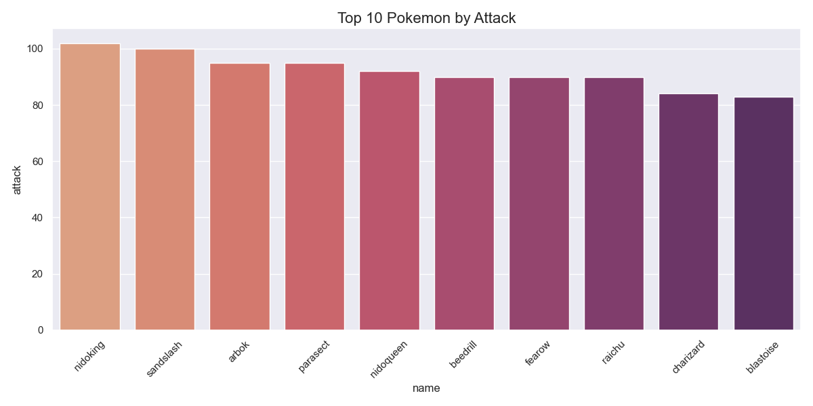
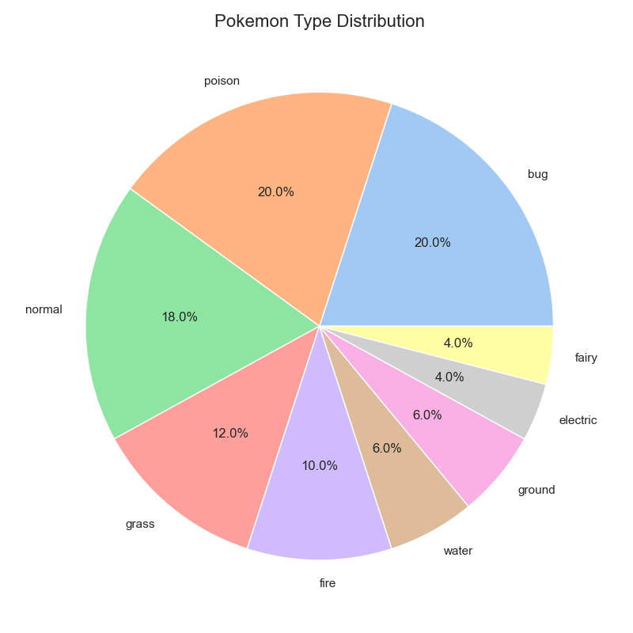
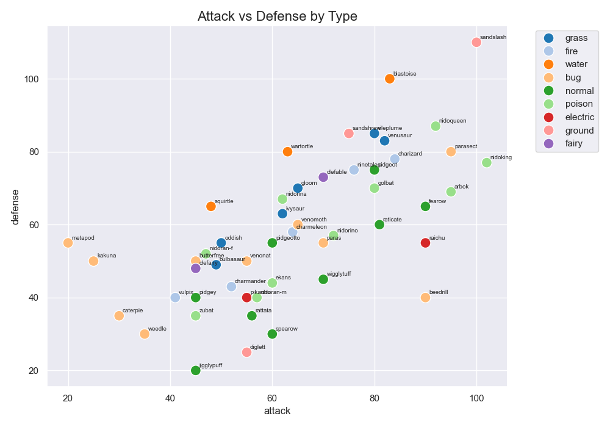
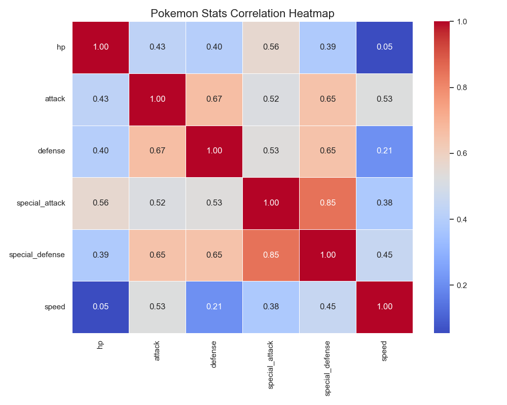
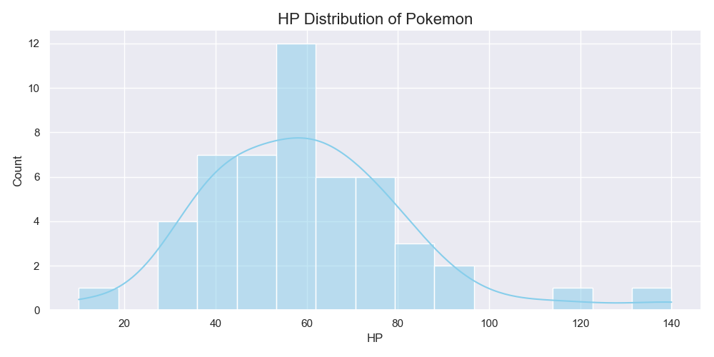

# 🎮 Pokemon Stats EDA — PokeAPI

Exploratory Data Analysis on first 50 Pokemon (Generation 1)
fetched using PokeAPI and Python.

## 📊 Visualizations

## 📂 Files
| File | Description |
|------|-------------|
| `pokemon_stats.csv` | Raw dataset (50 Pokemon) |
| `pokemon_eda.ipynb` | Jupyter Notebook with full analysis |

## 🛠️ Tools Used
- Python, Jupyter Lab
- Pandas, Matplotlib, Seaborn
- PokeAPI (free, no key needed)

## 💡 Key Insights
- Normal type Pokemon are most common in Gen 1
- High attack Pokemon tend to have lower defense
- Mewtwo has highest special attack stats

## 👩‍💻 Author
**Aditi Bhardwaj** | B.Tech CSE 2nd Year  
[LinkedIn](https://www.linkedin.com/in/aditi-bhardwaj-b4b52b33b/?lipi=urn%3Ali%3Apage%3Ad_flagship3_profile_view_base%3BIs6LEcDKQH2s2Jl167NtEg%3D%3D) | [Kaggle](https://www.kaggle.com/aditi501)
